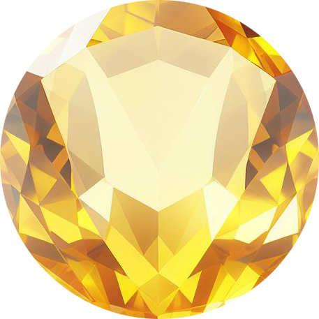

<!--  -->
 

  
  <h1 align="center">Hydra Launcher</h1>
  

    <strong>Hydra is a game launcher with its own embedded bittorrent client and a self-managed repack scraper.</strong>
  

  

    
    
    
  

 

## Table of Contents

- [About](#about)
- [Features](#features)